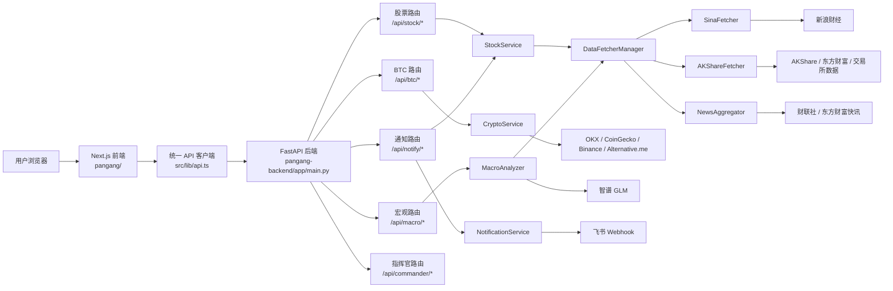
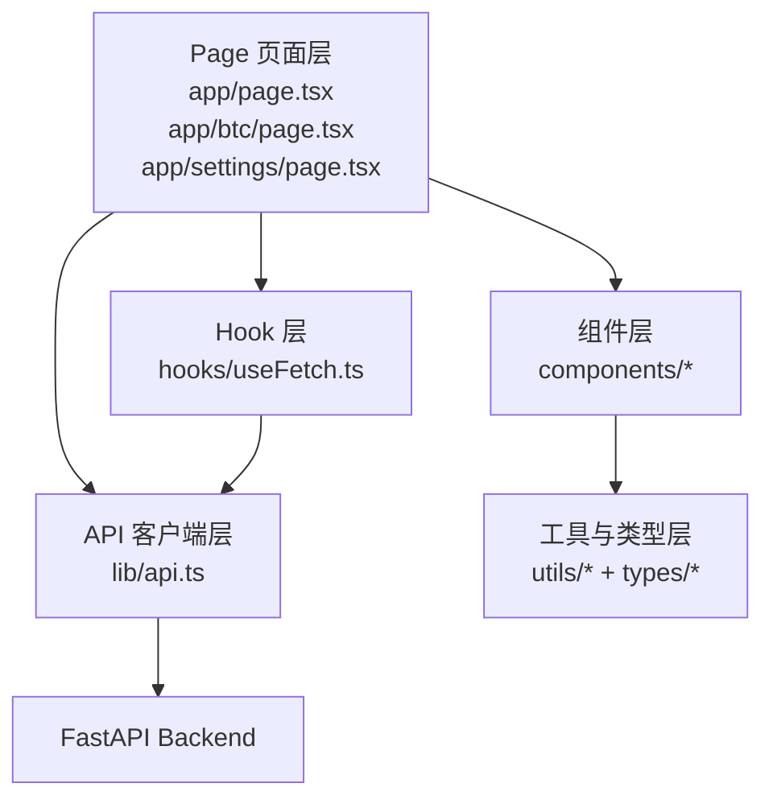
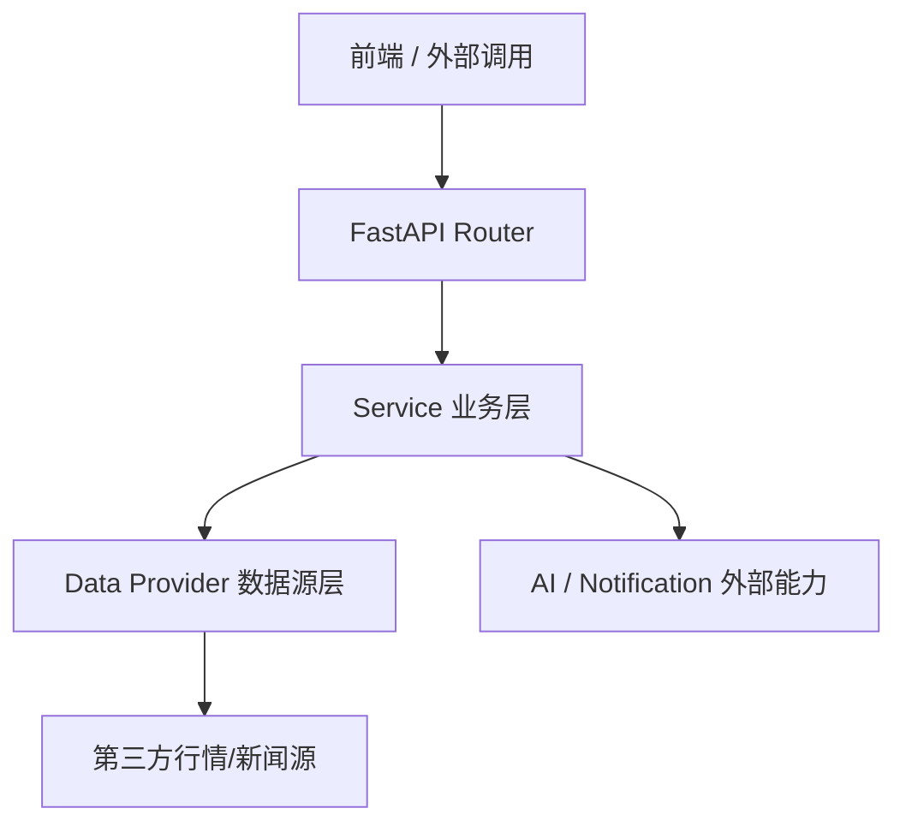
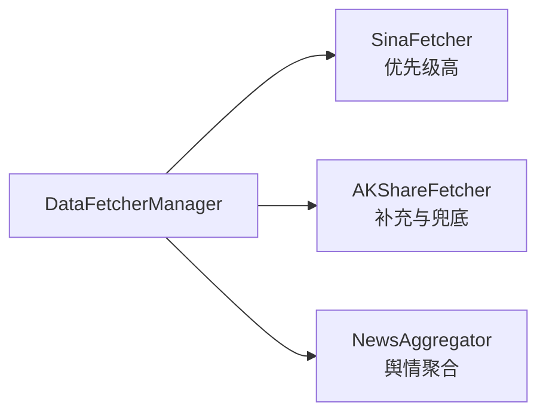
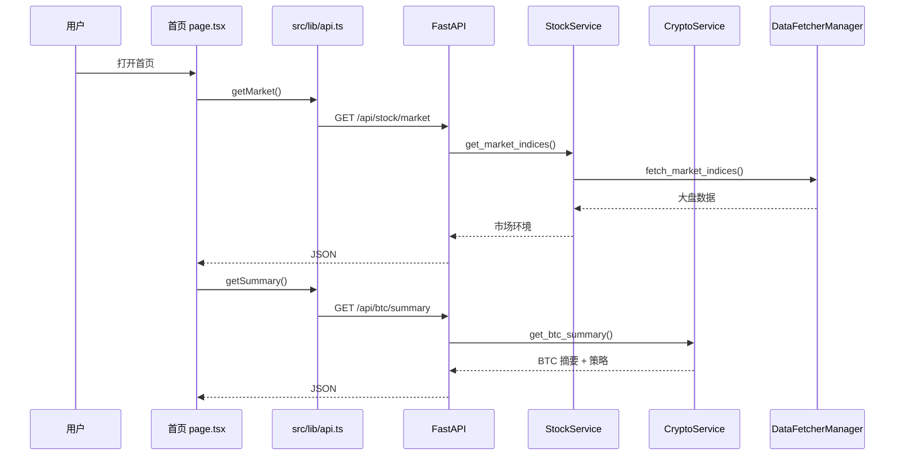
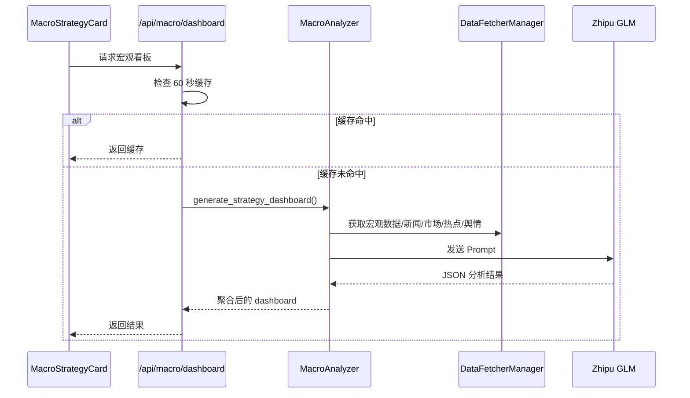
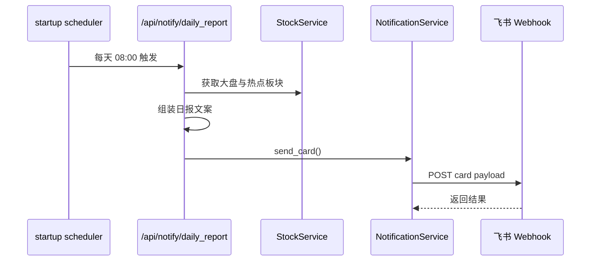

# BtcDashboard / 盘感 项目架构梳理

## 1. 项目概览

这是一个前后端分离的投资看盘系统，目录结构分为两部分：

- `pangang/`：前端，基于 Next.js App Router + React + TypeScript
- `pangang-backend/`：后端，基于 FastAPI + Python

项目目标是把 A 股、BTC、宏观新闻和 AI 分析整合到一个统一的仪表盘中，并提供通知推送能力。

## 2. 总体架构图



## 3. 目录与职责

### 3.1 前端

```text
pangang/src/
├── app/                  # 页面入口
├── components/           # 业务组件与通用 UI
├── hooks/                # 通用数据获取 hook
├── lib/                  # API 客户端
├── types/                # 类型定义
└── utils/                # 常量、格式化、校验
```

核心页面职责：

- `src/app/page.tsx`
  首页，看盘主入口，聚合 A 股环境、BTC 摘要、宏观策略卡片。
- `src/app/btc/page.tsx`
  BTC 详情页，展示更完整的技术面、市场状态、策略建议与 K 线。
- `src/app/chat/page.tsx`
  AI 对话页，目前以前端模拟回复为主，没有接入真实后端 LLM 服务。
- `src/app/settings/page.tsx`
  推送配置页，用于保存飞书机器人 webhook 并测试日报推送。

核心支撑层：

- `src/lib/api.ts`
  统一 API 封装，负责超时、重试、错误封装。
- `src/hooks/useFetch.ts`
  通用拉取 hook，支持轮询、并行拉取、渐进式拉取。
- `src/components/`
  负责展示层，如 K 线组件、宏观策略卡片、状态标签等。

### 3.2 后端

```text
pangang-backend/app/
├── main.py               # FastAPI 入口，挂载路由和启动定时任务
├── api/endpoints/        # 常规业务路由
├── routers/              # 独立路由模块（宏观）
├── services/             # 业务服务层
└── data_provider/        # 数据源适配层
```

核心职责划分：

- `main.py`
  应用启动、路由注册、CORS 配置、每日 08:00 定时报送任务。
- `api/endpoints/*.py`
  对外 API 层，做参数接收、调用 service、异常转 HTTP 错误。
- `services/*.py`
  业务编排层，负责聚合多个数据源并输出前端可直接消费的数据结构。
- `data_provider/*.py`
  数据获取层，通过策略模式切换不同抓取源。

## 4. 前端分层架构



### 4.1 主要调用关系

- 首页 `page.tsx`
  直接调用 `stockApi.getMarket()` 与 `btcApi.getSummary()`，并通过定时器轮询刷新。
- BTC 详情页 `btc/page.tsx`
  通过 `btcApi` 拉取摘要、技术面、K 线等数据，图表组件使用动态导入以避开 SSR。
- 设置页 `settings/page.tsx`
  直接使用浏览器 `fetch` 调用 `/api/notify/config`、`/api/notify/test`、`/api/notify/daily_report`。
- 宏观卡片 `MacroStrategyCard.tsx`
  消费 `/api/macro/dashboard` 的聚合结果。

### 4.2 前端特点

- 页面层承担了不少数据拉取和状态管理逻辑，组件与容器尚未完全分离。
- 存在两套调用风格：
  - 一套通过 `src/lib/api.ts`
  - 一套直接在页面里写死 `fetch('http://localhost:8000/...')`
- `chat/page.tsx` 当前是本地 mock，不是真正接入后端 AI 服务。

## 5. 后端分层架构



### 5.1 路由层

主要路由如下：

- `/api/btc/*`
  BTC 摘要、技术面、衍生品、网络健康度、全球市场、K 线。
- `/api/stock/*`
  A 股大盘、热门板块、板块详情、个股行情、技术分析、财务数据、资金流向。
- `/api/macro/*`
  宏观仪表盘、主线、催化、热搜。
- `/api/notify/*`
  webhook 配置、测试推送、日报推送。
- `/health`
  健康检查。

### 5.2 Service 层

#### `CryptoService`

职责：

- 拉取 BTC 价格与摘要信息
- 计算 7D / 30D 变化
- 生成动态策略、风险、模式识别
- 提供 K 线、衍生品、网络、市场等数据

数据源特征：

- 优先 OKX
- 失败时降级到 CoinGecko
- 情绪使用 Alternative.me Fear & Greed
- 内存缓存，缓存时间较短

#### `StockService`

职责：

- 获取 A 股市场环境
- 获取热点板块、板块详情、个股行情
- 提供技术分析、财务摘要、资金流向

它本身更像一个业务门面，真正数据切换由 `DataFetcherManager` 完成。

#### `MacroAnalyzer`

职责：

- 汇总宏观数据、新闻、市场环境、热点板块、舆情热搜
- 构造 Prompt
- 调用智谱 `glm-4-flash`
- 失败时退化为规则引擎输出

它是项目里最明显的“数据聚合 + AI 推理”模块。

#### `NotificationService`

职责：

- 保存与读取飞书 webhook
- 发送交互卡片消息
- 支持测试推送和日报推送

## 6. 数据源适配层

`DataFetcherManager` 是后端数据层的核心枢纽，采用“策略模式 + fallback”：



### 6.1 管理逻辑

- 初始化多个 fetcher 实例并按优先级排序。
- 查询大盘、热点、个股时，依次尝试 fetcher，成功即返回。
- 使用后台线程定时更新市场统计缓存，例如涨跌家数、涨跌停家数。
- 宏观新闻与舆情由 AKShare 和 NewsAggregator 组合提供。

### 6.2 已识别的数据源

- 新浪财经
- AKShare 封装的数据接口
- 东方财富相关数据
- 财联社电报
- OKX
- CoinGecko
- Alternative.me
- 智谱 AI
- 飞书机器人

## 7. 关键业务流

### 7.1 首页看盘流



### 7.2 宏观策略流



### 7.3 日报推送流



## 8. 当前架构特点

### 8.1 优点

- 前后端边界清晰，适合分别演进。
- 后端已经有明显的分层：路由层、服务层、数据源层。
- 数据源层具备 fallback 思路，适合行情类高波动接口。
- 宏观分析支持“AI 优先，规则兜底”，可用性较好。
- 内置定时推送，形成“看盘 + 分析 + 通知”闭环。

### 8.2 当前可见问题

- 前端 API 调用方式不统一，部分页面绕过了 `src/lib/api.ts`。
- 前端页面文件偏重，页面层既负责展示又负责较多业务逻辑。
- 宏观、通知、BTC 模块里都有一定“拼装型业务逻辑”，后续复杂度继续增长时可能需要再拆分。
- 后端存在进程内缓存和进程内定时任务，适合单实例开发环境，但多实例部署时会有一致性问题。
- `DataFetcherManager` 里的后台统计更新是线程内实现，生产可维护性一般。
- `chat/page.tsx` 目前是 mock 页面，与真实架构主链路还未打通。
- 仓库中包含 `venv/` 与日志文件，说明当前更偏本地开发形态，尚未完全工程化。

## 9. 建议的逻辑分层模型

如果后续继续演进，建议按下面这个稳定分层继续收敛：

```text
展示层（Next.js 页面 / 组件）
  -> 前端数据访问层（统一 API client + hooks）
    -> 后端路由层（FastAPI Router）
      -> 后端业务编排层（Service）
        -> 数据适配层（Fetcher Manager / Provider）
          -> 第三方数据源 / AI / 通知渠道
```

优先级最高的改进建议：

1. 前端统一通过 `src/lib/api.ts` 发请求，去掉页面里的硬编码 URL。
2. 将首页和 BTC 页的数据拉取逻辑抽成 hooks 或 container 组件。
3. 将后端的定时任务与缓存从进程内实现迁移到更清晰的基础设施层。
4. 给 `chat` 功能补真实后端接口，避免它游离于现有架构之外。

## 10. 关键文件索引

- 前端入口：`pangang/src/app/page.tsx`
- BTC 页面：`pangang/src/app/btc/page.tsx`
- 设置页面：`pangang/src/app/settings/page.tsx`
- API 客户端：`pangang/src/lib/api.ts`
- 通用 Hook：`pangang/src/hooks/useFetch.ts`
- 后端入口：`pangang-backend/app/main.py`
- BTC 路由：`pangang-backend/app/api/endpoints/btc.py`
- 股票路由：`pangang-backend/app/api/endpoints/stock.py`
- 宏观路由：`pangang-backend/app/routers/macro.py`
- 通知路由：`pangang-backend/app/api/endpoints/notify.py`
- BTC 服务：`pangang-backend/app/services/crypto_service.py`
- 股票服务：`pangang-backend/app/services/stock_service.py`
- 宏观服务：`pangang-backend/app/services/macro_analyzer.py`
- 通知服务：`pangang-backend/app/services/notification_service.py`
- 数据源管理：`pangang-backend/app/data_provider/manager.py`

## 11. 结论

这个项目已经具备一个比较完整的“投资信息聚合平台”雏形：

- 前端负责多页面仪表盘展示
- 后端负责聚合行情、新闻、AI 分析和消息推送
- 数据源层负责容错与切换

从架构成熟度看，它已经不是单页 demo，而是一个中等复杂度的业务系统。当前最值得做的不是推翻重写，而是继续把“统一数据访问、服务拆分、基础设施独立化”这三件事做扎实。
