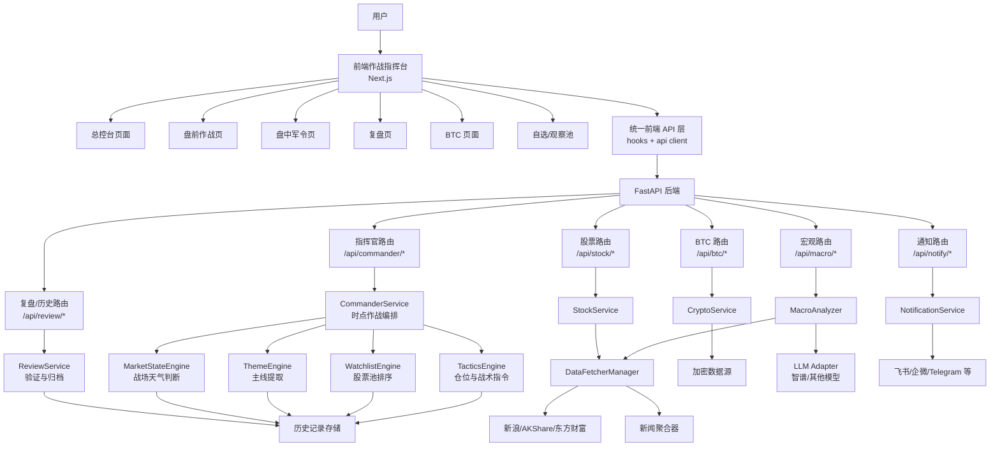

# 盘感产品方向方案：时点型作战指挥台

## 1. 目标定义

当前项目不建议继续朝“泛金融信息平台”扩张，而应收敛为一个更有差异化的产品方向：

**A股 + BTC + 宏观联动的时点型作战指挥台**

一句话定义：

**不是告诉用户市场发生了什么，而是告诉用户在关键时点该怎么打。**

这个方向的核心不是信息堆叠，而是：

- 强时间锚点
- 强执行建议
- 强验证/证伪机制
- 强闭环复盘

## 2. 为什么这么做

参考了三个方向：

- `daily_stock_analysis`
  更像全能型金融分析平台，功能广、覆盖多、自动化强。
- `AlphaEngine`
  更像投研工作台，强调资料处理、AI 问答、知识沉淀、可溯源。
- 现有 `openclaw skill`
  更像开盘时点的战役指挥系统，强调 09:25、09:30、10:00 等关键窗口的判断与动作。

综合判断：

- 不适合直接复制 `daily_stock_analysis` 的“大而全”。
- 也不适合直接走 `AlphaEngine` 的“重投研工作台”。
- 最适合的是把 `openclaw skill` 产品化，再吸收另外两个项目的优点。

因此推荐路径是：

**先做开盘作战系统，再做复盘闭环，最后补研究沉淀。**

## 3. 产品北极星

### 3.1 核心用户场景

用户在以下几个时点最需要帮助：

- 08:30 - 09:20：盘前准备
- 09:25：集合竞价结束，开盘前最后判断
- 09:30 - 10:00：开盘后确认与撤退窗口
- 14:30 - 15:00：尾盘确认与次日预案
- 收盘后：复盘、验证、推送、沉淀

### 3.2 产品核心承诺

系统要在每个关键时间点给出四类内容：

1. 市场天气
2. 主线判断
3. 可执行股票池
4. 验证点与证伪点

如果做不到这四件事，页面再丰富也不是真正的“指挥台”。

## 4. 产品形态

### 4.1 首页不再只是看盘页，而是作战总控台

首页建议逐步演进为以下结构：

1. `战场天气卡`
   输出当天当前时刻的竞价/开盘/盘中情绪级别。

2. `昨日验证卡`
   用来检验昨天的判断今天是否成立。

3. `双主线卡`
   明确一条进攻线、一条防守线。

4. `精锐股票池卡`
   每条主线给出首选、次选、观察。

5. `军令卡`
   明确开盘后 5 分钟、10 分钟、30 分钟怎么做。

6. `BTC 联动卡`
   作为特色能力，给出 BTC 风险偏好和对 A 股情绪的辅助判断。

7. `宏观/消息锚点卡`
   告诉用户今天主线来自哪里，避免 AI 输出像“无源之水”。

### 4.2 页面建议

```text
前台页面
├── 首页：作战总控台
├── 盘前页：09:25 开盘作战
├── 盘中页：09:30-10:00 动态军令
├── BTC 页：BTC 风险偏好与技术状态
├── 复盘页：昨日判断 vs 今日验证
├── 自选页：主题/股票观察池
└── 设置页：推送、提醒、账户与偏好
```

## 5. P0 / P1 / P2 路线图

## 5.1 P0：先做“开盘作战系统”

这是第一阶段最重要的部分。

### 目标

让系统在 `09:25` 到 `10:00` 之间具备“可信、直接、可执行”的指挥能力。

### 要做的能力

1. `战场天气`
   输入：竞价涨停家数、红盘率、龙头竞价状态、隔夜外盘、指数预期开盘。
   输出：艳阳天 / 震荡 / 暴雨。

2. `昨日验证`
   输入：昨日主线判断、昨日推荐股票池、今日竞价反馈。
   输出：高开验证 / 分化验证 / 低开打脸。

3. `今日双主线`
   输入：隔夜新闻、竞价爆量板块、外盘映射、宏观风险。
   输出：进攻主线、防守主线、有效期、验证点、证伪点。

4. `精锐股票池`
   输入：板块内竞价最强个股、中军、低位补涨。
   输出：首选、次选、观察、开盘战术。

5. `军令卡`
   输入：09:30 后前 5-30 分钟的实际反馈。
   输出：加仓条件、撤退条件、板块切换条件。

### P0 成功标准

- 用户在 09:25 打开应用，能在 30 秒内理解今天该怎么看。
- 输出必须带时间戳。
- 输出必须有证伪条件。
- 输出必须有仓位建议。

## 5.2 P1：补“闭环与沉淀”

### 目标

把一次性建议，升级成可验证、可回看、可推送的系统。

### 要做的能力

1. 历史作战记录
2. 昨日判断与今日验证对照
3. 推送体系
4. 自选股/主题观察池
5. AI 输出来源引用

### P1 成功标准

- 用户能看到过去若干天的判断记录。
- 每条主线都能回看是否兑现。
- 推送不是简单日报，而是“时点提醒 + 条件触发”。

## 5.3 P2：再做“研究中台”

### 目标

在不丢失“作战台”定位的前提下，逐步补投研沉淀能力。

### 要做的能力

1. 主题知识库
2. 资料摘要与消息归因
3. 分析结果归档
4. AI 多模型适配
5. 回测与策略复盘面板

### P2 原则

这些能力必须服务于交易指挥，不要把首页变成纯研究工具。

## 6. 整体未来架构图



## 7. 后端建议架构

现有后端已经有不错的基础，但未来要增加一层“指挥编排层”。

推荐后端分层如下：

```text
Router 路由层
  -> Commander / Review / Notify / Stock / BTC / Macro

Service 业务编排层
  -> CommanderService
  -> ReviewService
  -> NotificationService
  -> StockService / CryptoService / MacroAnalyzer

Engine 决策引擎层
  -> MarketStateEngine
  -> ThemeEngine
  -> WatchlistEngine
  -> TacticsEngine

Provider 数据适配层
  -> DataFetcherManager
  -> NewsAggregator
  -> Crypto external APIs
  -> LLM Adapter

Storage 持久化层
  -> 历史判断记录
  -> 股票池快照
  -> 推送记录
  -> 用户观察池
```

### 为什么要加 Engine 层

因为“时点型作战指令”不是简单调几个接口就能拼出来，它需要稳定的决策逻辑模块：

- 天气怎么判
- 主线怎么抽
- 股票怎么排序
- 什么时候加仓/撤退

如果这些逻辑继续散落在页面、service 或 prompt 里，后面会很难维护。

## 8. 前端建议架构

前端建议从“页面自己拉很多数据”演进成“总控台装配模式”。

```text
Page 页面层
  -> 负责布局、分区、路由

Container 容器层
  -> 拉取多个接口
  -> 组合成作战视图数据

Card 业务卡片层
  -> 战场天气卡
  -> 昨日验证卡
  -> 双主线卡
  -> 股票池卡
  -> 军令卡
  -> BTC 联动卡

Shared 层
  -> api client
  -> hooks
  -> types
  -> formatters
```

### 为什么这样拆

因为未来首页不是一张普通 dashboard，而是多个“指令单元”的组合。
用卡片化结构，后面做推送、历史回看、不同时间点展示会更容易。

## 9. 数据能力需求

如果要把这个方向做稳，下面这些数据能力是关键。

## 9.1 A股侧

P0 必需：

- 竞价涨停家数
- 红盘率 / 开盘涨跌家数
- 板块竞价强度
- 龙头股竞价状态
- 指数高开低开情况

P1 增强：

- 分时确认
- 板块轮动速度
- 自选股异动提醒
- 历史判断快照

## 9.2 BTC 侧

P0 必需：

- BTC 实时涨跌幅
- 情绪指标
- 技术位置
- 风险偏好标签

BTC 在这里的角色不是取代 A 股，而是作为风险偏好的辅助判断器。

## 9.3 宏观/消息侧

P0 必需：

- 隔夜外盘
- 隔夜重磅新闻
- 今日政策消息锚点
- 热点板块消息归因

### 关键原则

AI 结论最好尽量有来源锚点，否则“主线”会缺可信度。

## 10. 核心功能如何落地

## 10.1 战场天气卡

输入：

- 竞价涨停家数
- 红盘率
- 龙头一字板/核按钮
- 隔夜美股或外围风险

输出：

- `☀️ 艳阳天`
- `☁️ 震荡`
- `🌧️ 暴雨`

这张卡必须同时输出：

- 当前情绪标签
- 关键指标
- 仓位建议

## 10.2 昨日验证卡

输入：

- 昨日主线
- 昨日股票池
- 今日竞价反馈

输出：

- `高开验证`
- `分化验证`
- `低开打脸`

它的意义是让系统具备“自证与自纠”的能力。

## 10.3 双主线卡

必须包含：

- 逻辑来源
- 有效期
- 验证点
- 证伪信号

这是整个产品的灵魂卡片。

## 10.4 精锐股票池卡

每条主线下只给 3 个优先级：

- `⚡首选`
- `🥈次选`
- `👀观察`

每只股票都要带：

- 开盘价预期
- 竞价状态
- 战术动作

## 10.5 军令卡

要按时间窗给命令：

- `09:35 前`
- `10:00 前`
- `尾盘前`

用户看到后应该知道“加仓还是撤退”，而不是继续猜。

## 11. 与参考项目的借鉴关系

### 从 `daily_stock_analysis` 借什么

- 历史记录
- 回测/验证意识
- 自动化分发能力
- 多市场扩展思路

### 从 `AlphaEngine` 借什么

- AI 输出可溯源
- 研究资料沉淀
- 知识库能力

### 从 `openclaw skill` 借什么

- 强时间锚点
- 作战表达方式
- 验证/证伪机制
- 仓位与动作建议

## 12. 推荐的实施顺序

建议按下面顺序推进：

1. 明确“指挥台”定位，不再泛化功能边界。
2. 搭 P0 的 5 张核心卡。
3. 把 `CommanderService` 和 4 个 Engine 层抽出来。
4. 补历史记录与昨日验证闭环。
5. 再考虑知识库、回测、多模型、多渠道推送。

## 13. 最终判断

这个项目未来最值得做成的，不是资讯聚合器，也不是纯投研工具，而是：

**一个围绕关键时点给出清晰作战命令的盘感指挥系统。**

它的独特性应该来自三件事：

1. 比普通看盘应用更能下结论
2. 比普通 AI 分析更能给动作
3. 比普通交易工具更能解释为什么

如果这三件事做扎实，项目就会有非常清晰的产品辨识度。
