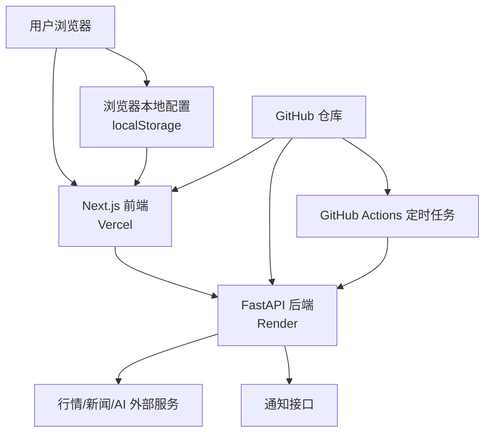

# 盘感项目部署与开源发布方案

## 1. 目标

这份文档解决四个问题：

1. 项目后续怎么免费部署上线
2. 哪些平台组合最适合当前前后端结构
3. 项目能不能上传到 GitHub 给大家分享
4. 设置页、用户配置、登录注册第一版到底要不要做

核心结论：

- 可以免费上线
- 可以上传到 GitHub 公开分享
- 第一版不建议先做登录注册
- 第一版建议采用“前后端分开部署 + 用户本地配置”的方式

## 2. 当前项目结构对部署的影响

当前项目不是单体静态站，而是：

- 前端：Next.js
- 后端：FastAPI
- 外部依赖：行情接口、新闻接口、AI API、通知 webhook
- 当前还包含定时任务逻辑

这意味着：

- 不适合只靠 GitHub Pages 这类纯静态托管完成全部部署
- 更适合前后端拆开部署
- 定时任务最好从应用进程里拆出来，交给外部调度系统

## 3. 免费部署的可选方案

## 3.1 方案 A：Vercel + Render + GitHub Actions

这是第一推荐方案。

### 组合方式

- 前端：Vercel
- 后端：Render
- 定时任务：GitHub Actions
- 代码托管：GitHub

### 为什么推荐

- Vercel 对 Next.js 友好，部署简单
- Render 对 FastAPI 支持直接
- GitHub Actions 适合定时调用日报接口
- 三者都支持免费起步

### 优点

- 搭建成本最低
- 和当前项目结构匹配最好
- GitHub 集成顺畅
- 适合作为第一版公开体验环境

### 缺点

- Render 免费实例可能冷启动
- 不适合追求正式生产级 SLA
- 定时任务要从进程内迁出去

## 3.2 方案 B：Cloudflare Pages + Render + GitHub Actions

适用于前端后续偏静态化或更在意静态资源分发的时候。

### 组合方式

- 前端：Cloudflare Pages
- 后端：Render
- 定时任务：GitHub Actions

### 优点

- 静态托管体验很好
- 免费额度友好
- 全球访问体验不错

### 缺点

- Next.js 适配成本通常高于 Vercel
- 当前阶段收益不如方案 A 明显

## 3.3 方案 C：Vercel + Koyeb + GitHub Actions

这是 Render 的替代方案。

### 组合方式

- 前端：Vercel
- 后端：Koyeb
- 定时任务：GitHub Actions

### 优点

- 也支持免费起步
- 能托管 Python API

### 缺点

- 团队对它的熟悉度往往不如 Vercel/Render
- 免费层细节需要单独核对

## 3.4 方案 D：GitHub Pages + 单独后端

仅在前端改为纯静态导出后适合考虑。

### 适用条件

- 前端使用静态导出
- 不依赖大量服务端渲染能力

### 当前判断

不建议作为当前主方案。

原因是你们后续大概率还会继续增强前端交互和时点指挥页面，不值得过早受静态化约束。

## 4. 推荐方案

推荐直接采用：

**GitHub + Vercel 前端 + Render 后端 + GitHub Actions 定时任务**

推荐理由：

1. 最符合现有项目结构
2. 免费上手最方便
3. 便于 GitHub 自动部署
4. 后续从免费升级到付费也顺畅

## 5. 为什么定时任务不能继续放在应用进程里

当前后端有“启动时创建每日 08:00 scheduler”的逻辑。

本地开发没问题，但部署到免费平台后会有这些问题：

- 服务实例可能休眠
- 服务实例可能重启
- 多实例时会重复触发
- 定时精度不可控

所以推荐改成：

- 后端保留一个“日报触发接口”
- 外部调度系统按时间调用该接口

第一版最省事的做法：

- 用 GitHub Actions 定时 `curl` 后端接口

## 6. 设置页与用户配置策略

## 6.1 第一版建议：不做登录注册

当前阶段不建议先做登录/注册/数据库用户系统。

原因：

- 当前最重要的是把产品主链路跑通
- 登录系统会显著增加复杂度
- 一旦做用户体系，就要处理鉴权、密码/OAuth、数据库、隐私与安全
- 这些都不是第一版最核心的问题

### 推荐策略

第一版使用：

**无登录 + 本地配置保存 + 平台环境变量**

## 6.2 配置分层

建议把配置分成两类。

### A. 平台级配置

由你们维护，放到部署平台环境变量：

- 后端基础 URL
- 默认模型提供商
- 站点 URL
- 平台默认开关
- 后端自己的公共 API key

### B. 用户级配置

由用户自己填写，优先保存在本地浏览器：

- 飞书 webhook
- 企微 webhook
- Telegram bot token / chat id
- 用户自己的 AI API key
- 推送偏好
- 风险偏好

## 6.3 第一版用户级配置存哪里

推荐：

- 浏览器 `localStorage`
- 或 IndexedDB

不推荐第一版就存到后端。

### 为什么

- 实现最简单
- 不需要账号体系
- 不需要数据库
- 用户自己对自己的 key 负责
- 降低你们的安全存储责任

## 6.4 设置页建议结构

设置页建议分成几个区域：

1. 通知设置
   - 飞书 webhook
   - 企微 webhook
   - Telegram bot token / chat id

2. AI 设置
   - 提供商
   - API key
   - 模型名

3. 偏好设置
   - A股 / BTC 开关
   - 风险风格
   - 是否接收推送
   - 时点提醒开关

4. 存储说明
   - 当前设置仅保存在本地浏览器
   - 更换设备不会自动同步

## 6.5 什么时候才需要登录注册

当你们需要下面这些能力时，再考虑登录：

- 多设备同步
- 云端保存自选股
- 云端保存历史作战记录
- 云端保存用户 webhook / AI key
- 用户订阅与权限系统
- 多用户长期在线使用

也就是说：

**第一版不需要为了设置页而强行上登录。**

## 7. 用户 AI Key 的处理建议

这个问题要分两种情况。

## 7.1 前端直连模型

特点：

- key 存在浏览器本地
- 请求由前端直接发给模型提供商

优点：

- 不需要你们代管用户 key
- 不需要后端存储用户 key

缺点：

- 前端暴露调用逻辑
- 不适合所有第三方服务

## 7.2 通过后端代理模型调用

特点：

- 用户 key 先传给后端
- 后端再代为调用模型接口

优点：

- 接口统一
- 更容易做输出格式控制

缺点：

- 如果要长期保存 key，就会引出用户系统和安全存储问题

### 第一版建议

- 若支持“用户自带 key”，优先本地保存
- 尽量避免第一版在后端长期保存用户私有 key

## 8. 开源发布是否可行

可以，而且很适合。

开源的好处：

- 更容易传播
- 更容易获取反馈
- 更方便展示项目思路
- 便于后续吸引贡献者

但当前仓库不能直接公开，需要先做清理。

## 9. 开源发布前必须处理的内容

## 9.1 敏感文件清理

在公开 GitHub 之前，必须处理这些内容：

- `.env`
- `.env.local`
- 任何 API key
- webhook 地址
- 本地日志文件
- 本地虚拟环境目录
- 本地缓存文件

### 当前仓库里要特别注意的内容

按当前目录情况，尤其需要检查：

- `pangang/.env.local`
- `pangang-backend/.env`
- `pangang-backend/venv/`
- `frontend.log`
- `backend.log`
- `pangang-backend/backend.log`

## 9.2 `.gitignore`

第一版开源前应该补齐 `.gitignore`，至少忽略：

```gitignore
# env
.env
.env.*
!.env.example

# node
node_modules/
.next/
out/

# python
__pycache__/
*.pyc
.venv/
venv/

# logs
*.log

# os/editor
.DS_Store
.idea/
.vscode/
```

## 9.3 开源基础文件

公开仓库前建议补齐：

- `README.md`
- `LICENSE`
- `.gitignore`
- `env.example`
- 部署说明

## 10. GitHub 分享建议

推荐做法：

1. 建一个公开仓库
2. 用 `README` 说明项目定位
3. 明确说明当前版本的部署方式
4. 明确说明用户自带配置如何使用
5. 用截图或演示图展示首页和 BTC 页

### README 应该重点讲什么

- 这个项目不是普通行情盘，而是“时点型作战指挥台”
- 支持 A股 + BTC + 宏观联动
- 默认本地配置，不需要账号即可体验
- 如何本地启动
- 如何免费部署

## 11. 第一版上线建议架构图



## 12. 后续如果要升级到账号体系，怎么走

如果未来用户量起来了，再逐步升级：

### 第二阶段

- 增加用户表
- 增加登录注册或 OAuth
- 增加数据库
- 把设置从本地同步到云端

### 第三阶段

- 增加权限体系
- 增加订阅/会员
- 增加多端同步
- 增加个人知识库与历史分析归档

重点是：

**这些都应该在产品主链路成立之后再做。**

## 13. 推荐执行顺序

建议按下面顺序推进：

1. 整理仓库，确保可安全开源
2. 补 `.gitignore`、`README`、`LICENSE`
3. 把前端后端拆分部署思路固定下来
4. 把进程内定时任务改成外部调度
5. 设置页按“本地配置”思路设计
6. 上线第一版公开体验
7. 收集反馈，再决定是否引入登录系统

## 14. 最终建议

当前阶段最优解不是一上来做完整 SaaS，而是：

**先做公开可体验版本，前后端免费部署，设置页本地保存，用户自己配置通知和 AI key。**

这样做有几个明显好处：

- 开发复杂度最低
- 上线速度最快
- 安全责任最轻
- 足够支撑第一波公开分享和验证

等产品方向跑通后，再决定要不要引入登录、数据库和用户同步能力。
